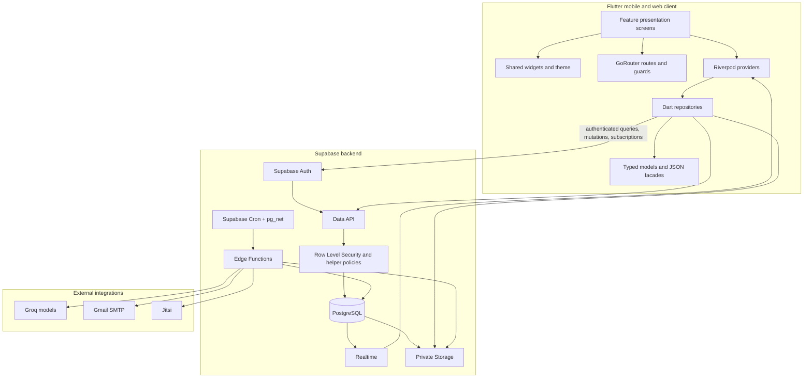

# CareNavigator PH System Architecture

## 1. Purpose and scope

CareNavigator PH is a healthcare-navigation and digital-care platform for the Philippines. It supports public hospital discovery, preliminary AI-assisted symptom guidance, guest consultation intake, patient and doctor workflows, hospital operations, platform administration, secure communication, and clinical-document processing.

This document describes the architecture implemented in the repository. It is a system-level view rather than a detailed database data dictionary or deployment runbook.

## 2. Architectural style

The system uses a layered client/server architecture with a managed backend:

- **Client:** one Flutter codebase for mobile and web.
- **Presentation and state:** feature-oriented Flutter screens, shared widgets, GoRouter, and Riverpod providers.
- **Data-access layer:** Dart repositories that wrap the Supabase client.
- **Backend platform:** Supabase Auth, PostgreSQL, Row Level Security (RLS), Realtime, private Storage, database triggers, and scheduled Edge Functions.
- **Serverless integration layer:** Supabase Edge Functions for privileged workflows, AI calls, account provisioning, and outbound notifications.
- **External services:** Groq for preliminary AI analysis, Gmail SMTP for opt-in email notifications, Jitsi for online consultations, OpenStreetMap tiles, and OSRM driving routes for the hospital map.

The public Flutter client uses only the Supabase URL and publishable client key. Administrative credentials, AI keys, SMTP credentials, bootstrap tokens, and scheduler tokens remain server-side.

## 3. High-level system context

```mermaid
flowchart LR
    Guest[Guest user]
    Patient[Patient]
    Doctor[Doctor]
    HospitalAdmin[Hospital administrator]
    SuperAdmin[Super administrator]

    Client[Flutter mobile/web client]
    Supabase[Supabase project]
    Groq[Groq AI]
    SMTP[Gmail SMTP]
    Jitsi[Jitsi video]
    Maps[OpenStreetMap + OSRM]

    Guest --> Client
    Patient --> Client
    Doctor --> Client
    HospitalAdmin --> Client
    SuperAdmin --> Client

    Client -->|publishable key + user JWT| Supabase
    Supabase -->|server-side AI requests| Groq
    Supabase -->|server-side email delivery| SMTP
    Client -->|load map tiles and driving routes| Maps
    Client -->|join approved consultation room| Jitsi
```

## 4. Logical architecture



## 5. Component responsibilities

### 5.1 Flutter client

The Flutter application is the user-facing layer for mobile and web. Its main feature areas are:

- Authentication and registration
- Home and hospital directory
- Map and hospital details
- Symptom assessment
- Guest consultation intake
- Patient/doctor care workspace
- Chat, notifications, dashboard, and profile
- Hospital and platform administration

The application starts in `lib/main.dart`, loads public configuration, initializes Supabase, and creates the Riverpod provider scope. `lib/src/routing/app_router.dart` defines the application routes and session-based redirects.

### 5.2 State and presentation layer

Feature screens live under `lib/src/features`. Shared layout, error/loading states, branding, and responsive components live under `lib/src/widgets`. Riverpod providers in `lib/src/providers/app_providers.dart` expose authentication state, hospital data, care workspaces, messages, notifications, analytics, and settings to the presentation layer.

Realtime streams are used for communication and notification updates. Future providers are used for request/response data and are invalidated or refreshed after mutations where appropriate.

### 5.3 Repository layer

Repositories isolate Supabase calls from the screens:

- `AuthRepository`: sign-in, registration, OTP/password flows, session changes, and profile retrieval.
- `HospitalRepository`: public hospital, department, service, availability, and doctor-directory queries.
- `AssessmentRepository`: anonymous-session symptom assessment and AI result retrieval.
- `ConsultationRepository`: guest consultation intake and related consultation actions.
- `CareRepository`: patient, doctor, communication, notification, video, analytics, and operational workflows.
- `AdminRepository`: administrative operations and account/hospital management.

This boundary keeps UI code focused on presentation and provides one place for Supabase query behavior and error handling.

### 5.4 Supabase Auth

Supabase Auth provides identity, sessions, JWTs, email OTP/password flows, and anonymous sessions for protected guest AI assessment. The application profile in `public.users` links an Auth user to an application role and, where applicable, a hospital.

### 5.5 PostgreSQL database

PostgreSQL is the system of record. The migration sequence establishes the schema, constraints, indexes, RLS policies, audit/security logging, clinical-integrity triggers, notification synchronization, analytics, and performance hardening.

The principal data domains are:

| Domain | Representative entities |
| --- | --- |
| Identity and authorization | `roles`, `users`, `patients`, `doctors`, permissions |
| Hospital directory and operations | `hospitals`, departments, services, rooms, beds, emergency-room and facility status |
| Scheduling and care | doctor schedules, consultations, assignments, diagnoses, treatment plans, prescriptions, laboratory requests/results |
| Guest access and AI | guest consultation requests, AI assessments, document-processing jobs |
| Communication | conversations, messages, attachments, video sessions, notifications, delivery outbox |
| Governance and observability | system settings, maintenance windows, analytics, audit logs, security logs |

Database constraints and triggers enforce important invariants such as valid statuses, capacity limits, consultation lifecycle transitions, and clinical-record synchronization.

### 5.6 Row Level Security and private Storage

RLS is the primary data-authorization boundary for client-accessible database operations. Access is scoped by authenticated user, application role, hospital assignment, doctor-patient assignment, consultation relationship, and record ownership.

Private files such as identity documents and medical records are stored in private buckets. The client receives short-lived signed URLs only after the corresponding database authorization succeeds. Service-role access is reserved for server-side Edge Functions.

### 5.7 Edge Functions

The Edge Functions form the server-only orchestration and integration layer:

- `admin-users`: bootstrap and manage administrative/doctor accounts and status changes.
- `analyze-symptoms`: validate a protected/anonymous request, apply deterministic emergency escalation, call Groq, validate structured output, and persist the preliminary assessment.
- `care-workflows`: perform privileged guest-to-patient conversion and related care-lifecycle transitions.
- `analyze-medical-result`: process uploaded laboratory results, coordinate OCR/AI analysis, track processing jobs, and support doctor review actions.
- `dispatch-notifications`: claim due notification-outbox entries, create reminders, and send opt-in email through Gmail SMTP.

Each function validates the request, checks authorization, performs server-side work, records relevant failures/security events, and returns a constrained response to the client.

## 6. Main data flows

### 6.1 Public hospital discovery

1. A guest opens the Flutter hospital directory.
2. The hospital repository queries approved/public hospital data through Supabase.
3. PostgreSQL policies expose only appropriate directory and operational fields.
4. The client displays hospital details, services, doctors, schedules, and availability.
5. Hospital locations and OSRM driving routes open in the in-app OpenStreetMap view; no map-provider secret is stored in Flutter.

### 6.2 Preliminary symptom assessment

1. The client obtains an anonymous Supabase session when needed.
2. The assessment repository invokes `analyze-symptoms` with a structured symptom payload.
3. The function verifies the JWT/session and applies deterministic emergency-warning checks.
4. Non-emergency requests are sent to Groq with a constrained JSON response contract.
5. The function validates the response, stores it in `ai_assessments`, and returns preliminary guidance.
6. Emergency results direct the user to call 911 or seek the nearest emergency department. AI output never becomes an official diagnosis.

### 6.3 Guest consultation to official patient care

1. A guest submits personal, location, symptom, department, schedule, and consultation information.
2. Email OTP verification protects the first-consultation access path.
3. A doctor or authorized workflow reviews the request.
4. `care-workflows` creates or converts the temporary patient/account state and links the consultation.
5. The patient books against published doctor slots.
6. The care workspace exposes only the records permitted by the patient's, doctor's, hospital administrator's, or platform administrator's role.

### 6.4 Medical-result processing

1. An authorized patient or doctor uploads a medical result to private Storage.
2. A database record and processing job track the document state.
3. `analyze-medical-result` retrieves the authorized file, extracts/uses supported content, and calls Groq where configured.
4. The result remains preliminary until a doctor modifies, confirms, or rejects it.
5. Confirmed data is synchronized to the official patient record and the patient receives an in-app notification.

### 6.5 Notifications and reminders

1. Care actions create in-app notifications and, where configured, notification-outbox entries.
2. Supabase Cron invokes `dispatch-notifications` on its configured schedule.
3. The function claims due entries using bounded retry/backoff and deduplication behavior.
4. Opted-in messages are delivered through Gmail SMTP.
5. Delivery status and failures remain auditable in the backend.

## 7. Authorization model

| Actor | Primary access scope |
| --- | --- |
| Guest | Public hospital information, anonymous assessment, and verified guest consultation intake |
| Patient | Own profile, consultations, messages, notifications, medical history, and authorized files |
| Doctor | Assigned hospital, assigned/consultation patients, clinical documentation, schedules, and result review |
| Hospital administrator | One assigned hospital's operations, staff, services, availability, appointments, and hospital audit data |
| Super administrator | Platform configuration, hospital approval, account administration, governance, and platform analytics; no automatic unrestricted clinical-record access |

The UI provides role-aware routes and workspaces, but database RLS and server-side authorization are the authoritative enforcement mechanisms.

## 8. Security and privacy boundaries

- The Flutter client contains only public Supabase connection configuration.
- Authenticated requests carry Supabase JWTs; privileged functions validate authorization before using server-side credentials.
- RLS prevents cross-patient, cross-doctor, and cross-hospital data access.
- Private Storage objects are not exposed as permanent public URLs.
- Signed file URLs are short-lived and scoped to an authorized request.
- Account-status checks prevent inactive or unapproved accounts from using protected workflows.
- Audit and security logs record sensitive administrative and workflow events.
- AI output is explicitly preliminary and requires licensed-doctor review before becoming part of the official clinical record.
- Emergency warning signs use deterministic escalation and direct users to immediate emergency care.

## 9. Deployment architecture

```text
Developer workstation
   ├─ Flutter build for Android/iOS/web
   ├─ Supabase migrations applied in timestamp order
   └─ Supabase Edge Functions deployed with server-side secrets

Runtime
   ├─ Mobile app package or hosted Flutter web artifact
   ├─ Supabase Auth/API/Realtime/Storage/PostgreSQL
   ├─ Supabase Edge Functions
   ├─ Supabase Cron + pg_net
   └─ Groq, Gmail SMTP, Jitsi, OpenStreetMap, and OSRM integrations
```

The repository's deployment configuration is in `supabase/config.toml`. Environment-specific public client settings are supplied through asset configuration or `--dart-define`. Server secrets are provisioned through Supabase secret storage and are not compiled into the client.

## 10. Reliability and operational considerations

- Database constraints and transactions protect care-lifecycle and capacity data.
- Realtime subscriptions reduce polling for messages and notifications.
- Notification dispatch uses idempotency/deduplication and bounded retries.
- Processing jobs make medical-document analysis observable and recoverable.
- Audit/security logs support incident review and administrative accountability.
- SQL regression scripts under `supabase/tests` verify important backend workflows.
- Flutter analysis, unit/widget tests, and web/Android builds provide client verification.

## 11. Architectural limitations and future evolution

The current design is appropriate for a managed, serverless healthcare application and a small-to-medium deployment. As usage grows, the following areas should be formalized and monitored:

- Centralized production observability, alerting, and trace correlation across Flutter, Edge Functions, and database jobs.
- Backup, disaster-recovery, retention, and clinical-record restoration procedures.
- Formal key rotation and secret-management procedures for all environments.
- Load testing for Realtime, notification dispatch, document processing, and high-volume hospital availability updates.
- A versioned API contract or generated schema types if multiple clients or third-party integrations are introduced.
- Independent privacy/security review and healthcare compliance assessment before production clinical use.

## 12. Source-of-truth locations

- Flutter entry point: `lib/main.dart`
- Application routing: `lib/src/routing/app_router.dart`
- Riverpod wiring: `lib/src/providers/app_providers.dart`
- Repository layer: `lib/src/repositories/`
- Domain models: `lib/src/models/`
- Database migrations: `supabase/migrations/`
- Edge Functions: `supabase/functions/`
- Backend regression tests: `supabase/tests/`
- Local setup and deployment notes: `README.md`
