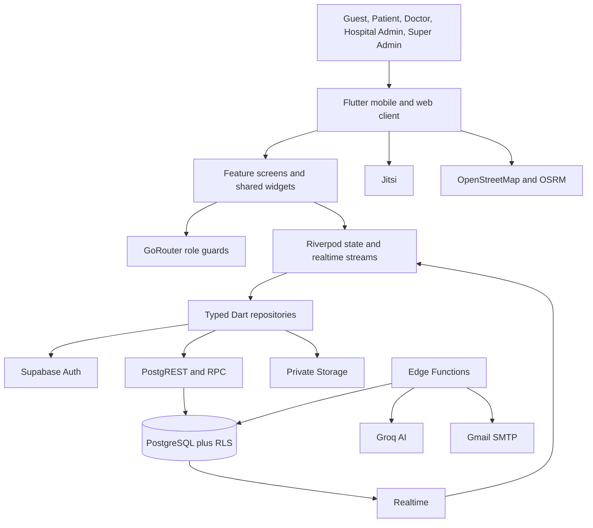
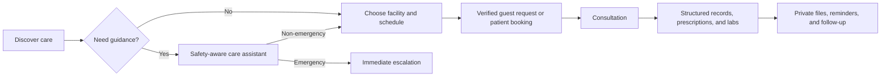
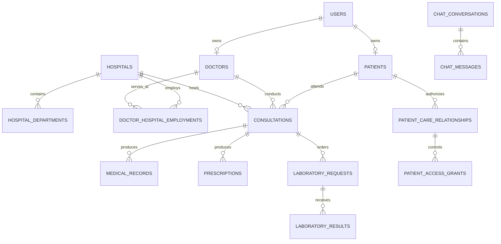

# CareNavigator PH - Mermaid Diagrams

These diagrams are source-controlled Mermaid definitions for the current CareNavigator PH architecture. In VS Code, open Preview (`Ctrl+Shift+V`) with a Mermaid Markdown extension installed, or open the individual `.mmd` files.

## Updated System Architecture

## Updated End-to-End System Flow

## Conceptual Database ERD

The complete editable ERD is in `database_erd.mmd`. It emphasizes the main identity, hospital, scheduling, cross-hospital authorization, clinical-record, and communication relationships used by the application.

> Note: This is a defense-oriented conceptual model, not a replacement for the complete live Supabase schema or migration history. Row Level Security policies, helper functions, triggers, indexes, and audit tables remain defined in the database layer.
